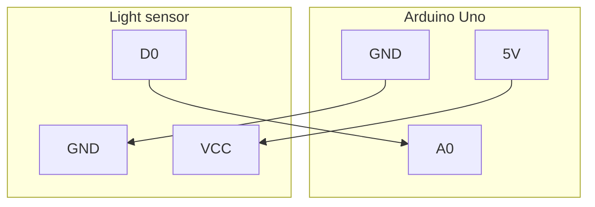

Energy meter
============

this program counts LED flashes from the energy meter and every few seconds writes the count of LED flashes seen to serial port.


Hardware
--------

### Parts list

- [Arduino Uno](https://tinygo.org/docs/reference/microcontrollers/arduino/)
	* because I had one extra lying around which I won't probably use for anything else
- [Light sensor](https://www.amazon.de/-/en/dp/B07DJ4LHTR)


### Wiring diagram




### How to flash

```console
$ docker run --rm -it -v "$(pwd):/src" --entrypoint=bash --workdir=/src --device=/dev/serial/by-id/usb-Arduino__www.arduino.cc__0043_852353531373514151F0-if00:/dev/ttyUSB0 --group-add dialout tinygo/tinygo:0.30.0
$ sudo apt update && sudo apt install -y avrdude
$ tinygo flash -target=arduino
```


Why not use better integration
------------------------------

My meter actually has optical port and there would be more robust integration available, but the meter
is changing soon, so I won't build the most robust integration for a throwaway use.
