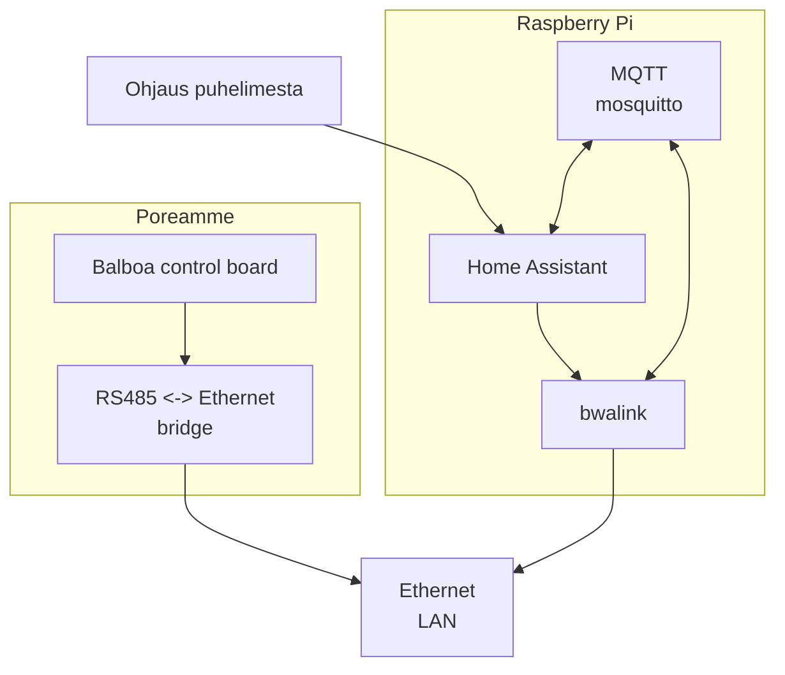
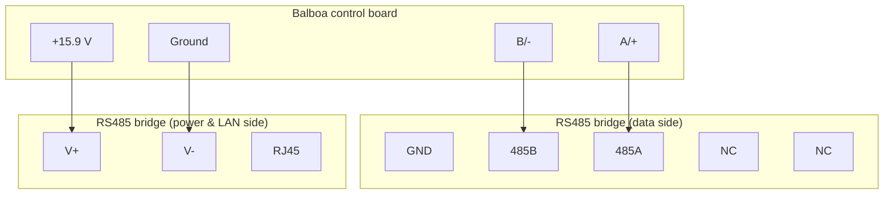
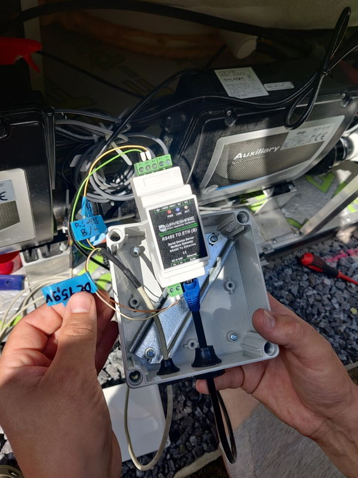

Henkan poreamme
===============

Hardware
--------

### Wiring diagram

### Bridge configuration

Looks like one can access it over web interface in port 80.

The URL is `http://192.168.1.254/`

| Configuration | Value  |
|---------------|--------|
| Baud rate     | 115200 |
| Data bits     | 8      |
| Parity        | None   |
| Stop bits     | 1      |
| Flow control  | None   |

The TCP port for serial port is `4196`

Troubleshooting:

- The "pwr" light should stay always lit
- When serial is connected properly and receiving data from the control board, the "act" light should blink in rapid succession
- The "link" light should be stably lit. It seemed to only light up after we connected ethernet, so it might indicate ethernet link?

Software
--------

Home Assistant -> MQTT

bwalink -> MQTT

### Install steps

- install mqtt
- install home assistant
- configure MQTT to home assistant
- install bwalink

### TODO

- static IP reservation for RS485 bridge
- Tailscale for raspberry pi
- Tailscale for Henkka

Links
-----

- [Balboa hottub integration without wifi module](https://community.openhab.org/t/balboa-hottub-integration-without-wifi-module/147110)
- [Homepage: RS485 <-> Ethernet](https://www.waveshare.com/wiki/RS485_TO_ETH_(B))
- [Amazon: RS485 <-> Ethernet](https://www.amazon.de/RS485-Ethernet-Converter-Industrial-Auto-Negotiation-transparent/dp/B09QMNWYLQ)
- [Protocol notes](https://github.com/ccutrer/balboa_worldwide_app/blob/main/doc/protocol.md)
- [Ready app](https://github.com/ccutrer/balboa_worldwide_app)
