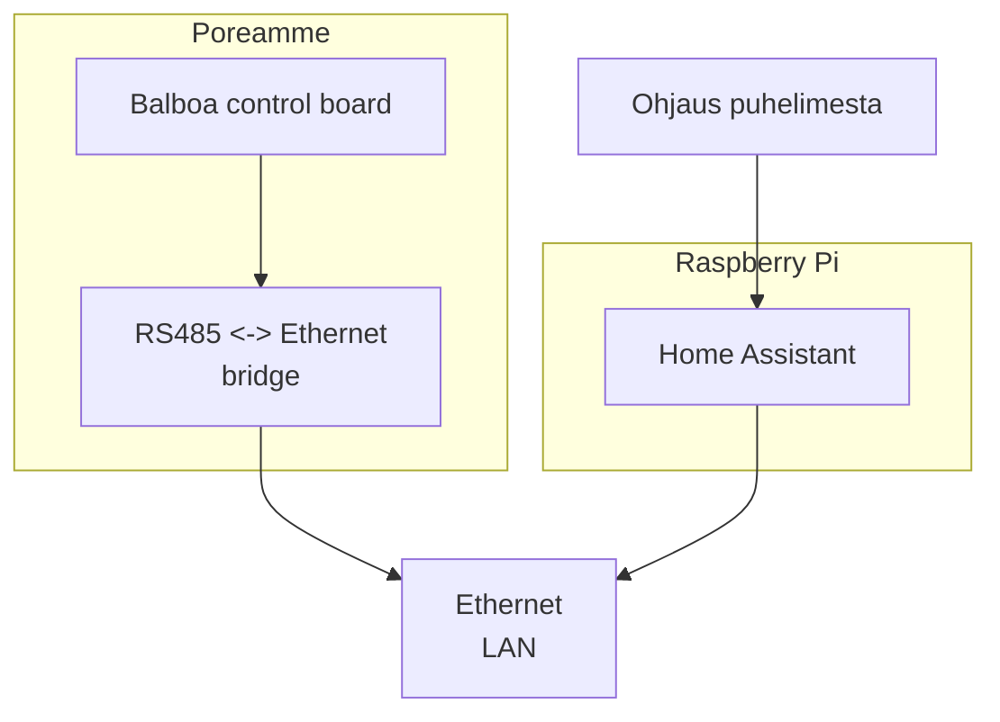

Henkan poreamme
===============

Hardware
--------

### Wiring diagram

### Bridge configuration

Looks like one can access it over web interface in port 80.

| Configuration | Value  |
|---------------|--------|
| Baud rate     | 115200 |
| Data bits     | 8      |
| Parity        | None   |
| Stop bits     | 1      |
| Flow control  | None   |

Software
--------

TODO

Links
-----

- [Balboa hottub integration without wifi module](https://community.openhab.org/t/balboa-hottub-integration-without-wifi-module/147110)
- [Homepage: RS485 <-> Ethernet](https://www.waveshare.com/wiki/RS485_TO_ETH_(B))
- [Amazon: RS485 <-> Ethernet](https://www.amazon.de/RS485-Ethernet-Converter-Industrial-Auto-Negotiation-transparent/dp/B09QMNWYLQ)
- [Protocol notes](https://github.com/ccutrer/balboa_worldwide_app/blob/main/doc/protocol.md)
- [Ready app](https://github.com/ccutrer/balboa_worldwide_app)
